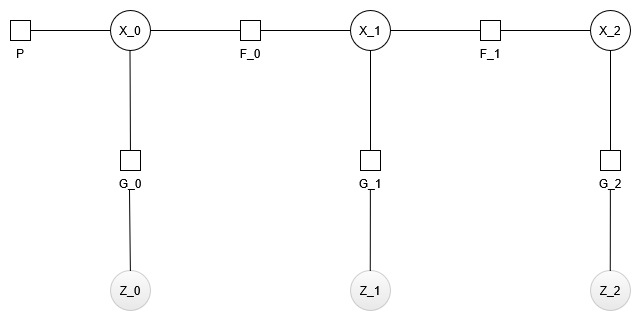

# COMP0249 — Question 1a: Factor Graph for GPS-Enabled Localization

A factor graph is an undirected bipartite graph which represents the factorisation of a joint probability distribution over a set of unknown variables. It represents a model of unknown variables and their dependencies with the graphs vertices being divided into 2 sets:
- Variable Nodes (Drawn as circles): Represent the unknowns that need to be estimated by the graph
- Factor Nodes (Drawn as squares): represent the information required to solve for the unknowns; measurements or prior information.

Edges in the graph connect variable nodes to the factor nodes which they depend on. Where no edge may connect 2 variable nodes or 2 factor nodes directly; they can only connect vertices from one set to the other set.

## Variable Nodes (Vertices)

The only variable node in this problem is the vehicle pose vertex; which is given by equation 1 of appendix A.2

$$x_k = \begin{pmatrix}x_k \\\ y_k \\\ \psi_k \end{pmatrix}\qquad \qquad (1)$$

In this equation $x_k$ and $y_k$ are the position coordinates in the world-fixed frame and $\psi_k$ is the bearing of the vehicle.

## Addition Operator

Addition operators define how variable nodes are updated - taking a perturbation: $\delta = [\delta_x, \delta_y, \delta_{\psi}]^T$ to update the state estimate during optimisation:

$$x_k \oplus \delta = \begin{bmatrix} x_k + \delta_x \\\ y_k + \delta_y \\\ (\psi_k + \delta_\psi) \bmod 2\pi \end{bmatrix}$$

Position components $x_k$ and $y_k$ use standard addition operation and live in $\mathbb{R}^2$. The bearing lives in $S^1$ due to its different addition operator. The state space is therefore $\mathbb{R}^2 \times S^1$. Noting that the bearing addition operator is different because bearing is a value between 0 and $2\pi$ whereby after exceeding $2\pi$ it returns to $0$ rather than being continuous like the $x_k$ and $y_k$ operators.

## Factor Nodes (Edges)

### Prior Factor (Unary)

The prior factor is an anchor for the initial pose to prevent the graph being underconstrained.

| Property        | Description                                                                         |
| --------------- | ----------------------------------------------------------------------------------- |
| **Type**        | Unary                                                                               |
| **Connects to** | $x_0$                                                                      |
| **Equation**    | $x_0 \sim \mathcal{N}(\boldsymbol{\mu}_0, \boldsymbol{\Sigma}_0)$          |
| **Measurement** | Initial state estimate $\boldsymbol{\mu}_0$ with covariance $\boldsymbol{\Sigma}_0$ |
| **Residual**    | $e_{\text{prior}} = x_0 \ominus \boldsymbol{\mu}_0$               |

### Process Factor (Binary)

| Property        | Description                                                                                                    |
| --------------- | -------------------------------------------------------------------------------------------------------------- |
| **Type**        | Binary                                                                                                         |
| **Connects to** | $x_k$ and $x_{k+1}$                                                                          |
| **Equation**    | Eq. 3 & 4 (A.2): $x_{k+1} = x_k + M(\psi_k)\,(u_{k+1} + v_{k+1})$ |
| **Measurement** | Odometry input $u_{k+1} = [s_k, 0, \dot{\psi}_k]^\top$                                            |
| **Residual**    | $e_{\text{proc}} = x_{k+1} \ominus [x_k + M(\psi_k)\,u_{k+1}]$    |
| **Noise**       | $v_{k+1} \sim \mathcal{N}(0, Q_k)$, diagonal                                        |

This factor is non-linear due to M depending on $\psi_k$ (Eq. 4), requiring iterative linearisation.

### GPS Measurement Factor (Unary)

| Property        | Description                                                                         |
| --------------- | ----------------------------------------------------------------------------------- |
| **Type**        | Unary                                                                               |
| **Connects to** | $\mathbf{x}_{k+1}$                                                                  |
| **Equation**    | A.3: $z_{k+1}^G = [x_{k+1}, y_{k+1}]^\top + w_{k+1}^G$        |
| **Measurement** | GPS position fix $z_{k+1}^G \in \mathbb{R}^2$                              |
| **Residual**    | $e_{\text{GPS}} = z_{k+1}^G - [x_{k+1}, y_{k+1}]^\top$         |
| **Noise**       | $w_{k+1}^G \sim \mathcal{N}(0, R^G)$, diagonal, constant |

This factor is linear — it directly observes position, not heading.

## Factor Graph Diagram

**Legend:**
- **(X_k)** — Variable nodes (circles): vehicle pose at timestep $k$
- **[P]** — Prior factor (square): unary prior on initial pose $\mathbf{x}_0$
- **[F_k]** — Process factors (squares): binary odometry factors encoding Eq. 3 & 4 (A.2)
- **[G_k]** — GPS factors (squares): unary GPS measurement factors (A.3)
- **[Z_k]** — GPS Measurements (circles): Measurements that are used by the GPS factors during optimisation. The circles are shaded to represent that they themselves are not optimised. 

The process factors form a Markov chain. The GPS factors provide position corrections. Together they are complementary: without GPS the trajectory drifts; without process factors the heading is unobservable.
